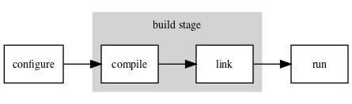
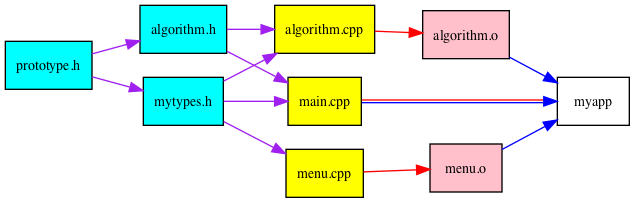

# Make and friends

<https://ese-msc-2023.github.io/ppp-make/slides/make.html>

j.percival@imperial.ac.uk


### The three stages of generating a unix executable from source code



 - Configure - find external libraries and required tools
 - Build - Compile code and link executable
 - Run - use executable (maybe many times)


### Configuring - `autotools` & `cmake`

Linux packages often use tools like `cmake` [(www.cmake.org)](www.cmake.org) or `autotools` [(autotools.io)](autotools.io) to deal with finding libraries and file paths (semi)automatically


Installation instructions look something like

```
./configure
make
```

for `autotools` based projects or (for `cmake`)

```
cmake -DMY_VARIABLE=seven .
make
```


### Compiling & Linking

For now we'll concentrate on the build step.

We can "just" call the compiler by hand

```c++
#include <stdio.h>

int main(int argc, char** argv){
  printf("Hello World!\n");
  return 0;
}
```

```bash
$> cc hello.c -o hello
$> ./hello
Hello World!
$>
```


### The Windows version

On Unix-like systems (macs & linux):

- default C compiler is `cc`, default C++ compiler is `c++`
- linker is `ld` (can usually just call compiler)
- On linux `cc` is usual `gcc`, the gnu compiler
- On Mac `cc` is clang (due to licensing)


On Windows:
- Compiler is `cl.exe` for both,
- Linker is `link.exe`.
- Configure `.vcxproj` files with `msbuild.exe` or `devenv.exe`.
- Need these things in the `PATH`.

See the [Microsoft documentation](https://learn.microsoft.com/en-us/cpp/build/building-on-the-command-line?view=msvc-170) for more.


### MPI Wrappers

On unix like systems:

- executable scripts like `mpicc` & `mpic++` wrap compiler to add in libraries/include path
- use `mpicc --show` to see what it's actually doing.

```bash
$> mpicc --show
gcc -I/usr/lib/x86_64-linux-gnu/openmpi/include/openmpi -I/usr/lib/x86_64-linux-gnu/openmpi/include -pthread -L/usr/lib/x86_64-linux-gnu/openmpi/lib -lmpi
```


### Compiling & Linking
Operations get very complicated as you include more compiler options, link to more source files, include more headers from non-standard paths and link to more and more libraries:

```
c++ -DUSE_VTK=1 -I/usr/local/include -I/apps/vtk myfile.cpp \
 myotherfile.cpp another_file.o yetanotherfile.o \
 -O3 -g -ffast-math -lX -lm -L/usr/lib/vtk-6.3 \
 -lvtkCommonCore -lpng -o myfile
```


### Compiling & Linking

Here we're using various (gcc/clang) compiler options:
- The `-D` sets macros for `#ifdef` etc
- The `-I` adds to the header search path (`.h` files)
- The `-L` adds to the library search path (`.a` or `.so` files)
- The `-O3` specifies maximum compiler optimizations (`-O0` would be none.)
- The `-g` leaves in names for debugging
- The `-lpng` links in a `libpng` library (using the shared `libpng.so` version by default).


### Compiling & Linking



Code units must also be rebuilt _in order_ as their dependencies are updated.

A lot of stuff to remember. Nicer to automate.


### A shell script version

A halfhearted attempt will put commands in a text file, say `compile.sh`

```
#!/usr/bin/env bash

c++ -DUSE_VTK=1 -I/usr/local/include -I/apps/vtk myfile.cpp \
 myotherfile.cpp another_file.o yetanotherfile.o \
 -O3 -g -ffast-math -lX -lm -L/usr/lib/vtk-5.10 \
 -lvtkCommonCore -lpng -o myfile
 ```


Can set the file to be excutable

```
chmod u+x compile.sh
```
(run one time), then do

```
./compile.sh
```

every time we rebuild


This is OK for one-file builds, but gets annoying for large code bases

- Rebuilds the whole thing every time
- Complex to make things optional
- Different people need different files.


### GNU make (and BSD make)
#### A program to build programs

The GNU tool `make` uses "recipes" from text files, called `Makefile`s to automate and control the build process.

Basic help available at the command line: `make -h`, `man make` or `info make`.


Original `make` was created by Stuart Feldman in April 1976 at Bell Labs.

Windows has its own similar version called `nmake`

Gnu `make` and windows `nmake` very incompatible, due to things like `-I` versus `/I`.


_Make originated with a visit from Steve Johnson storming into my office, cursing the Fates that had caused him to waste a morning debugging a correct program (bug had been fixed, file hadn't been compiled, cc *.o was therefore unaffected)._

_As I had spent a part of the previous evening coping with the same disaster on a project I was working on, the idea of a tool to solve it came up._

— Stuart Feldman, The Art of Unix Programming, Eric S. Raymond 2003


### GNU make: A program to build programs

A `Makefile` consists of a list of `target`s, listing the dependency structure, along with recipes to build each target from its prerequisites.


### GNU make: A program to build programs
The general syntax is

```
# Lines starting with # are comments
<target name> : [prerequite1 prerequite2 ...]
	recipe line 1
	[recipe line 2]
	[...]
```

as a trivial example:

```
biscuit:  eggs.cpp flour.cpp sugar.cpp
	$(CXX) eggs.cpp flour.cpp sugar.cpp -o biscuit
```


### GNU make: A program to build programs
Run the command to build the biscuit target as
```
make biscuit
```
(or just `make` to build default target, usually first one)
- By default, recipe lines must start with `tab` characters, NOT spaces (sometimes an issue with VS code)
- Variables are referenced with `$(variable_name)` or `${variable_name}`
- Defaults to run each line in its OWN subshell (i.e. environment).


### GNU make: A program to build programs

Can get faster rebuilds by storing intermediate files

```
eggs.o: eggs.cpp
	$(CXX) eggs.cpp -c

flour.o: flour.cpp
	$(CXX) flour.cpp -c

sugar.o: sugar.cpp
	$(CXX) sugar.cpp -c

biscuit:  eggs.o flour.o sugar.o
	$(CXX) eggs.o flour.o sugar.o -o biscuit
```


### GNU make: A program to build programs

Now if we change `flour.cpp`, and run
```
make biscuit
```

- Only the `flour.o` object file will be recompiled.
- The executable `biscuit` is still relinked.


### GNU make: A program to build programs

We can also use "patterns" to define recipes based on wildcard matching and variable expansion

```
%.o : %.c
	$(CC) -c $(CFLAGS) $(CPPFLAGS) $< -o $@

biscuit:  eggs.o flour.o sugar.o
	$(CC) eggs.o flour.o sugar.o -o biscuit
```

(this one is actually already a default)


### GNU make: A program to build programs

Make has a _lot_ of default recipes installed with it.

- May or may not do what you wanted.
- Often cause confusion about why things broke.
- If in doubt, we recommend writing things more explicitly.


### Make variables

Make variables can be:

- Set in the Makefile itself as `VARNAME=<value>` (no tabs)
- Set at the command line with `make CXX=icpc`
- Inherited from the environment (eg. an earlier `export VARNAME=<value>`)


### Make variables

- Some variables like `${CC}`come with preassigned with default values (usually GNU tools such as gcc).
- Tools like CMake and autotools build up variables to build Makefiles.


### Make functions

As well as variables, `make` has functions.

The syntax is very similar

```
$(<function name> <arg1> [<arg2> ...])
```


To collect a list of all functions ending `.cpp`:

```
SRC_FILES = $(wildcard src/*.cpp)
```

To get a list with the `.cpp`s replaced with `.o`s:
```
OBJ_FILES = $(patsubst %.cpp,%.o,${SRC_FILES})
```


### Common target names

Some target names have become "standard" in Makefiles:

- `all` is usually set to depend on all final outputs (so everything gets built)
- `install` copies files as necessary to install the project
- `clean` deletes any built targets etc.


```
INSTALL_DIR = "${HOME}/bin"

all: myapp mytools;

install:
	cp myapp $(INSTALL_DIR)

clean:
	rm -rf src/*.o myapp mytools
```


### `.PHONY`: Forcing rebuilds

Difficulties if you have a text file called `install` with installation instructions & an `install` target.

Make may think target is up-to-date, so nothing to do.


Fix this by adding a line

```
.PHONY: install
```

Tells `make` that install doesn't really produce output, & should always run.


### Running multiple recipes at once

`make` has an option `-j` to try to run multiple recipes at the same time.

Eg. to allow up to 4 jobs at once (one is actually a manager)
```
make -j4 all
```
Since targets must wait for their dependencies to be built, this may not speed things up much.


### Using make on an HPC clusters

- On systems supporting environment modules, want to load module files _before_ calling `make`.
- Can call `make` inside a job script, but don't generally want to run using `mpiexec`.
- For small job, might choose to run on the login node.
- Often want to send to a short serial queue.
- If working on a local disk, remember to copy back/install your output (not an issue on DUG).


```
#PBS -N make_example
#PBS -l walltime=0:30:00
#PBS -l select=1:ncpus=1:mpiprocs=1:mem=1800mb

module load intel-suite
module load mpi
  
export CXX=mpicxx
export CC=mpicc
 
cd mypackage
./configure
make clean
make
```


### Further reading

- A longer make tutorial:

[swcarpentry.github.io/make-novice](https://swcarpentry.github.io/make-novice/)

- (far too much) make documentation:

[www.gnu.org/software/make/manual](https://www.gnu.org/software/make/manual)

- Information on the gcc optimization flags 

[https://gcc.gnu.org/onlinedocs/gcc/Optimize-Options.html](https://gcc.gnu.org/onlinedocs/gcc/Optimize-Options.html)
